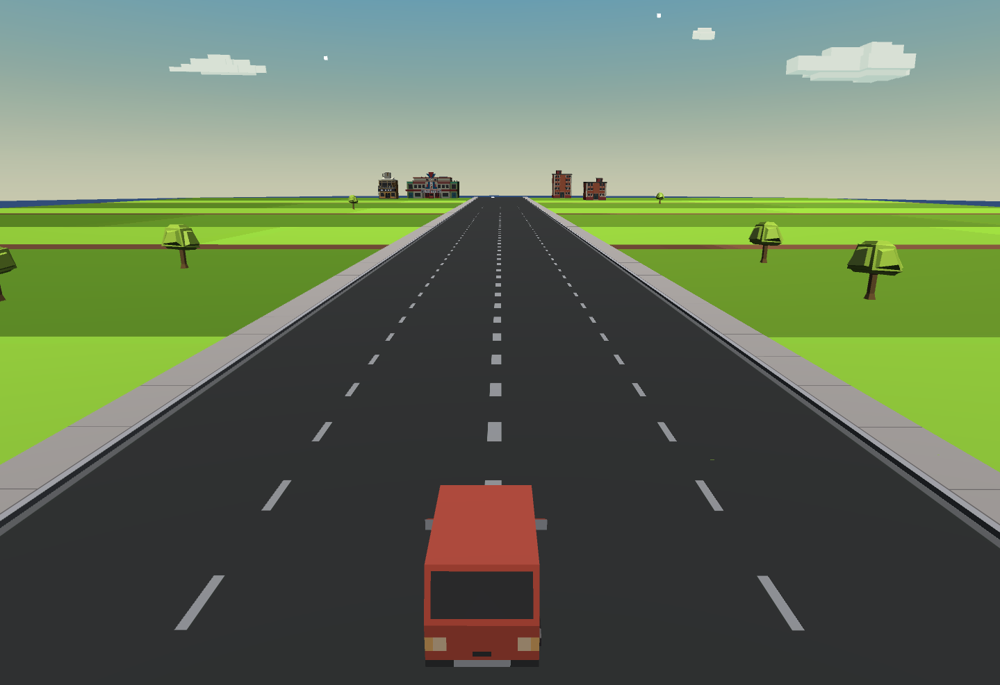
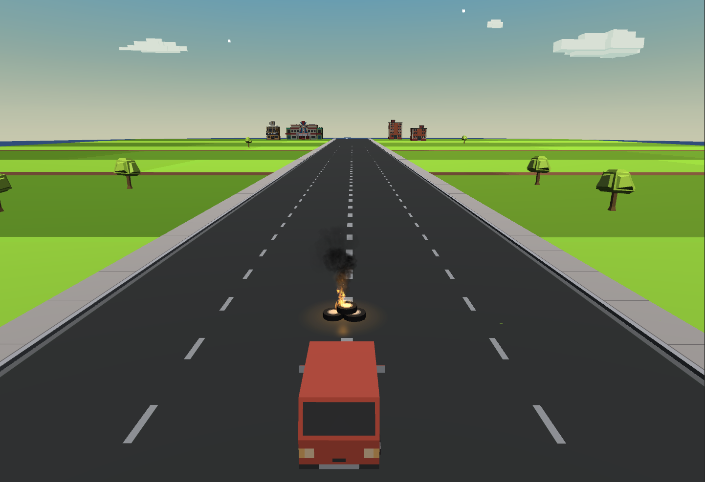

# Example: Driving and Encountering an Obstacle

This is an example for [Howland's Law of Information Locality](../README.md)

## Initial Scenario

1. You are in a car, in the center of a wide one-way road, with no obstacles or other cars around you, and no turns or other decisions to be made for a long time.
2. You are going straight, there is no reason to change direction.  The initial situation is stable, and without obstacles.  It's legal and OK to be driving in between lanes for this example.
3. No other options are available, such as "Slow down", "Stop" or "Transform and Fly Away".  Only "Turn Right" and "Turn Left" are available options for this example scenario.

## Problem Introduction

1. From the Initial Scenario...
2. An obstable is introduced ahead of the car's path.
3. There are 2 options available in this scenario:  "Turn Right" or "Turn Left"
4. Can you determine, through use of statistics, for this given problem, whether one should statistically "Turn Right" or "Turn Left"?
5. Given unlimited resources, could you design an experiment and create a set of statistical data that would allow you to determine whether you should statistically "Turns Right" or "Turn Left" for this specific case?

## Assertion

1. Because the data available is local to the single problem case (an obstacle in front of your car, right now), the only valid data is local to the situation.
2. No amount of data about other situations will tell you whether you should "Turn Right" or "Turn Left" in this situation, because that information would be based on data from different situations, where those obstacles and those cars had different relationships between them, than your car and the obstacle currently in front of it.
3. Only this unique situation will have the exact data that you need to determine a correct action, which is based on the data local to your situation:  Where the obstacle exists in relation to your car.
4. The only data relevant to making this decision will come from the local data, which is:  If the obstacle is closer to the Right Side of the car, you should "Turn Left" to better avoid it, and conversely if the obstacle is closer to the Left Side of the car, you should "Turn Right" to better avoid it.  If the obstacle is directly in the center of your car, then either option is equally valid, so you can "Turn Left" with the maximum available safety.
5. No amount of non-local data that could be analyzed would be able to give anything but pure chance as to the location of the obstacle in relation to your car, to determine which direction is best to avoid the obstacle.
6. Additionally, external information has the potential to be biased through assumptions in test formulation, which are unrelated to the physical location of your car and the obstacle, in this moment in time.

## Go Back

(Back to the Law of Information Locality)[../README.md]
